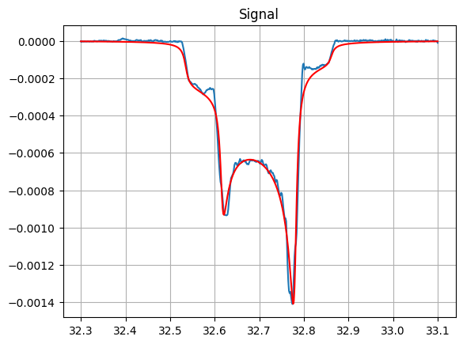

# Deuteron Peak Fit for NMR Signal Analysis

Fitting routine for spin-1 NMR signals with quadrupolar splitting Pake doublets, based on C code by C. Dulya. [[1]](#1) 

Uses Non-Linear Least-Squares Minimization and Curve-Fitting for Python (LMFIT), https://lmfit.github.io/lmfit-py/


### Usage
May be called as object "DFits" which requires passing a list of frequency points, a list signal magnitudes at each point, and a parameter dictionary.
```
fit_results = DFits(freqs, sweep, params)

r = fit_results.result.params['r'].value
pol = (r * r - 1) / (r * r + r + 1)
```
The return is a LMFIT ModelResult object (https://lmfit.github.io/lmfit-py/model.html#lmfit.model.ModelResult).

The success of the fit is highly dependent on the initial parameters passed. The parameter dictionary is label based on Dulya's convention:
* A: Width due to dipolar broadening
* G: Scale factor
* r: Asymmetry parameter, representing relative sizes of two peaks
* wQ: Quadrupolar splitting frequency width
* wL: Nuclear Larmor frequency (in same units as the passed frequency list)
* eta: Peak width factor
* xi: False asymmetry correction from mistuning



Example Fit of 42% Polarized Deuteron Signal at 5T taken on ND<sub>3</sub> during Run Group C at [Jefferson Lab](https://www.jlab.org/).

### Example
An example signal is included for fitting. example.py gives an example usage which will plot this signal to test your installation.

## Author
Written in 2021 by J. Maxwell (https://orcid.org/0000-0003-2710-4646).
## References

<a id="1">[1]</a> 
Dulya, C. et. al.  "A line-shape analysis for spin-1 NMR signals"
NIM A, 398, 109-125 (1997). (https://doi.org/10.1016/S0168-9002(97)00317-3)
