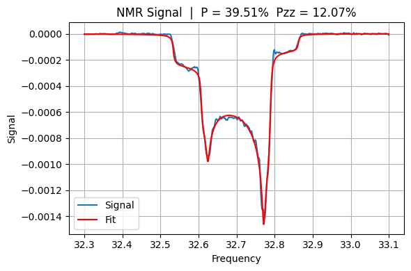

# Deuteron Peak Fit for NMR Signal Analysis

Fitting routine for spin-1 NMR signals with quadrupolar splitting Pake doublets, based on C code by C. Dulya. [[1]](#1)

Uses Non-Linear Least-Squares Minimization and Curve-Fitting for Python (LMFIT), https://lmfit.github.io/lmfit-py/

### Functions

Three fitting functions are provided, each returning an lmfit ModelResult object (https://lmfit.github.io/lmfit-py/model.html#lmfit.model.ModelResult).

**`fit_deuteron(freqs, signal, initial_params)`**
Absorption-only fit to the Dulya lineshape.

**`fit_deuteron_complex(freqs, signal, initial_params)`**
Fits the complex signal — absorption and dispersion mixed by a receiver phase angle. Adds parameter `phase`. The dispersion component is computed analytically as the Kramers-Kronig partner of the absorption lineshape, following Kisselev et al. (1995) [[2]](#2) and McClellan (2025). [[3]](#3)

**`fit_deuteron_complex_cubic(freqs, signal, initial_params)`**
Complex lineshape with a cubic polynomial baseline correction. Adds parameters `c3, c2, c1, c0`.

### Usage

```python
from deuteron_fit import fit_deuteron

initial_params = {
    'A':  0.5,
    'G':  1.0,
    'r':  1.0,
    'wQ': 1e5,
    'wL': 2.13e8,
    'eta': 0.0,
    'xi': 0.0,
}

result = fit_deuteron(freqs, signal, initial_params)
```

The success of the fit is highly dependent on the initial parameters passed.

### Polarization from fit results

The fitted `r` parameter is the Boltzmann population ratio between the m=+1 and m=-1 spin states. Vector polarization P and tensor polarization A or P<sub>zz</sub> can be calculated from it directly:

**Vector polarization:**

$$P = \frac{r^2 - 1}{r^2 + r + 1}$$

**Tensor polarization:**

$$P_{zz} = \frac{(r-1)^2}{r^2 + r + 1}$$

lmfit reports the standard error on each parameter as `result.params['r'].stderr`. Propagating this through both formulas:

$$\sigma_P = \frac{r^2 + 4r + 1}{(r^2 + r + 1)^2} \cdot \sigma_r$$

$$\sigma_{P_{zz}} = \frac{3|r^2 - 1|}{(r^2 + r + 1)^2} \cdot \sigma_r$$

In code:

```python
r      = result.params['r'].value
r_err  = result.params['r'].stderr
denom  = r**2 + r + 1

P      = (r**2 - 1) / denom
Pzz    = (r - 1)**2 / denom

P_err   = (r**2 + 4*r + 1) / denom**2 * r_err
Pzz_err = 3 * abs(r**2 - 1)  / denom**2 * r_err
```

Other fitted values and their uncertainties are accessed the same way, e.g. `result.params['wQ'].value` and `result.params['wQ'].stderr`. The full lmfit result object also provides fit statistics, covariance matrix, and a fit report via `result.fit_report()`.

### Parameters

Parameters follow Dulya's convention:

| Parameter | Description |
|-----------|-------------|
| `A` | Width due to dipolar broadening |
| `G` | Scale factor |
| `r` | Asymmetry parameter — relative sizes of the two peaks |
| `wQ` | Quadrupolar splitting frequency width |
| `wL` | Nuclear Larmor frequency (same units as `freqs`) |
| `eta` | Peak asymmetry factor |
| `xi` | False asymmetry correction from receiver mistuning |
| `phase` | Receiver phase angle (complex fits only) |
| `c3,c2,c1,c0` | Cubic baseline coefficients (cubic fit only) |

### Bounds and constraints

Bounds and other per-parameter constraints are set inline in `initial_params` using lmfit's dict format:

```python
initial_params = {
    'A':  {'value': 0.5, 'min': 0.0, 'max': 1.0},
    'wQ': {'value': 1e5, 'min': 0.0},
    'G':  1.0,   # plain scalar, no bounds
}
```

See the [lmfit documentation](https://lmfit.github.io/lmfit-py/parameters.html) for additional options such as `vary` and `expr`.

### Example

An example signal is included for fitting. `example.py` gives an example usage which will plot the signal to test your installation.



Example fit of 42% polarized deuteron signal at 5T taken on ND<sub>3</sub> during Run Group C at [Jefferson Lab](https://www.jlab.org/).

## Author
Written in 2021 by J. Maxwell (https://orcid.org/0000-0003-2710-4646).

## References

<a id="1">[1]</a>
Dulya, C. et. al. "A line-shape analysis for spin-1 NMR signals"
NIM A, 398, 109-125 (1997). (https://doi.org/10.1016/S0168-9002(97)00317-3)

<a id="2">[2]</a>
Kisselev, Yu.F., Dulya, C.M., Niinikoski, T.O. "Measurement of complex RF susceptibility using a series Q-meter"
NIM A, 354, 249-261 (1995). (https://doi.org/10.1016/0168-9002(94)01066-8)

<a id="3">[3]</a>
McClellan, M. "Complex deuteron NMR signals"
Eur. Phys. J. A, 61, 176 (2025). (https://doi.org/10.1140/epja/s10050-025-01644-z)
